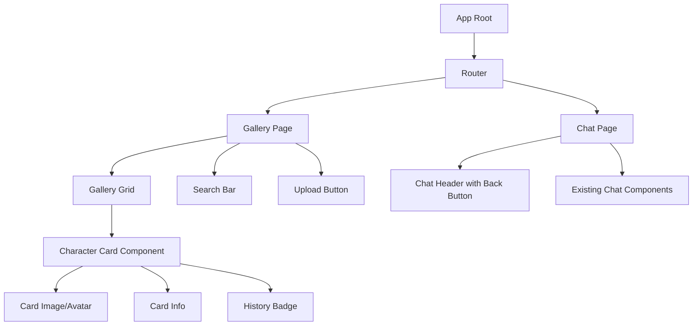
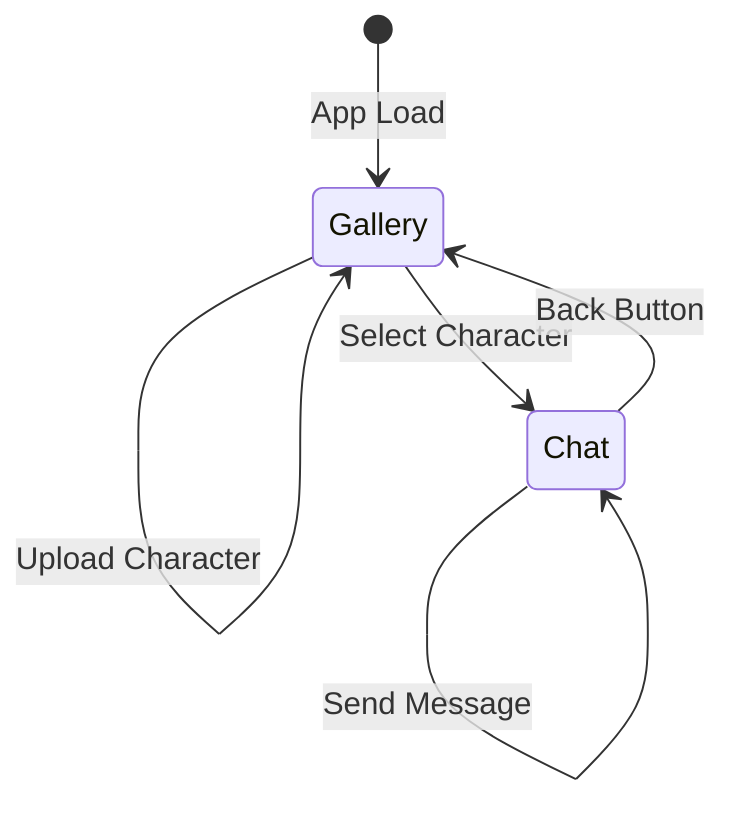

# Design Document

## Overview

This feature transforms the chat application's user experience by introducing a character card gallery as the primary entry point. Instead of immediately showing a chat interface with a dropdown selector, users will first see a visually rich grid of character cards similar to character.ai. This design creates a more engaging and intuitive way to browse and select characters before starting conversations.

The implementation will use React Router for navigation, maintain separate conversation sessions per character, and integrate seamlessly with the existing character card system and chat infrastructure.

## Architecture

### High-Level Flow

```
App Load → Character Gallery (Home) → Character Selection → Chat Interface
                ↑                                                  ↓
                └──────────────── Back Navigation ────────────────┘
```

### Component Hierarchy



### Navigation State Management



## Components and Interfaces

### 1. Router Setup (`public/src/main.tsx`)

Add React Router for navigation between gallery and chat:

```typescript
import { BrowserRouter, Routes, Route } from 'react-router-dom';
import { GalleryPage } from './pages/GalleryPage.js';
import { ChatPage } from './pages/ChatPage.js';

// Update main.tsx to use router
ReactDOM.createRoot(document.getElementById('root')!).render(
  <React.StrictMode>
    <BrowserRouter>
      <Routes>
        <Route path="/" element={<GalleryPage />} />
        <Route path="/chat/:characterId?" element={<ChatPage />} />
      </Routes>
    </BrowserRouter>
  </React.StrictMode>
);
```

### 2. Gallery Page Component (`public/src/pages/GalleryPage.tsx`)

Main gallery page that displays character cards:

```typescript
export interface GalleryPageProps {}

export interface CharacterWithHistory {
  card: CharacterCardListItem;
  conversationCount: number;
  lastMessageAt?: string;
  lastMessagePreview?: string;
}

export function GalleryPage() {
  const [characters, setCharacters] = useState<CharacterWithHistory[]>([]);
  const [loading, setLoading] = useState(true);
  const [searchQuery, setSearchQuery] = useState('');
  const [showUpload, setShowUpload] = useState(false);
  const sessionId = getOrCreateSessionId();
  
  // Load characters and their conversation history
  useEffect(() => {
    async function loadCharactersWithHistory() {
      const cards = await listCharacterCards();
      const conversations = await listConversations(sessionId);
      
      // Map conversations to characters
      const charactersWithHistory = cards.map(card => ({
        card,
        conversationCount: conversations.filter(c => c.character_card_id === card.id).length,
        lastMessageAt: findLastMessage(conversations, card.id),
        lastMessagePreview: getLastMessagePreview(conversations, card.id),
      }));
      
      setCharacters(charactersWithHistory);
    }
    
    loadCharactersWithHistory();
  }, [sessionId]);
  
  // Filter characters based on search
  const filteredCharacters = characters.filter(ch =>
    ch.card.data.data.name.toLowerCase().includes(searchQuery.toLowerCase()) ||
    ch.card.data.data.description.toLowerCase().includes(searchQuery.toLowerCase())
  );
  
  return (
    <div className="gallery-page">
      <GalleryHeader 
        onSearch={setSearchQuery}
        onUpload={() => setShowUpload(true)}
      />
      <GalleryGrid 
        characters={filteredCharacters}
        onSelectCharacter={(id) => navigate(`/chat/${id}`)}
      />
      {showUpload && (
        <UploadModal 
          onClose={() => setShowUpload(false)}
          onUploadSuccess={(newCard) => {
            setCharacters([...characters, { card: newCard, conversationCount: 0 }]);
            setShowUpload(false);
          }}
        />
      )}
    </div>
  );
}
```

### 3. Gallery Grid Component (`public/src/components/GalleryGrid.tsx`)

Responsive grid layout for character cards:

```typescript
export interface GalleryGridProps {
  characters: CharacterWithHistory[];
  onSelectCharacter: (characterId: string) => void;
}

export function GalleryGrid({ characters, onSelectCharacter }: GalleryGridProps) {
  if (characters.length === 0) {
    return (
      <div className="gallery-empty">
        <p>No characters yet. Upload your first character to get started!</p>
      </div>
    );
  }
  
  return (
    <div className="gallery-grid">
      {characters.map(ch => (
        <CharacterCard
          key={ch.card.id}
          character={ch}
          onClick={() => onSelectCharacter(ch.card.id)}
        />
      ))}
    </div>
  );
}
```

### 4. Character Card Component (`public/src/components/CharacterCard.tsx`)

Individual character card with hover effects and history indicators:

```typescript
export interface CharacterCardProps {
  character: CharacterWithHistory;
  onClick: () => void;
  onDelete?: (id: string) => void;
  onEdit?: (id: string) => void;
}

export function CharacterCard({ character, onClick, onDelete, onEdit }: CharacterCardProps) {
  const [showMenu, setShowMenu] = useState(false);
  const { card, conversationCount, lastMessageAt, lastMessagePreview } = character;
  
  return (
    <div className="character-card" onClick={onClick}>
      <div className="card-image">
        {/* Placeholder or avatar image */}
        <div className="card-avatar">{card.data.data.name[0]}</div>
      </div>
      
      <div className="card-content">
        <h3 className="card-name">{card.data.data.name}</h3>
        <p className="card-description">{truncate(card.data.data.description, 100)}</p>
        
        {card.data.data.personality && (
          <p className="card-personality">{truncate(card.data.data.personality, 60)}</p>
        )}
      </div>
      
      {conversationCount > 0 && (
        <div className="card-history-badge">
          <span className="badge-count">{conversationCount} chat{conversationCount > 1 ? 's' : ''}</span>
          {lastMessageAt && (
            <span className="badge-time">{formatRelativeTime(lastMessageAt)}</span>
          )}
        </div>
      )}
      
      <div className="card-actions" onClick={(e) => e.stopPropagation()}>
        <button onClick={() => setShowMenu(!showMenu)}>⋮</button>
        {showMenu && (
          <div className="card-menu">
            {onEdit && <button onClick={() => onEdit(card.id)}>Edit</button>}
            {onDelete && <button onClick={() => onDelete(card.id)}>Delete</button>}
          </div>
        )}
      </div>
    </div>
  );
}
```

### 5. Chat Page Component (`public/src/pages/ChatPage.tsx`)

Wrapper for existing chat interface with navigation:

```typescript
export function ChatPage() {
  const { characterId } = useParams<{ characterId: string }>();
  const navigate = useNavigate();
  const chat = useChat();
  
  // Set character when page loads
  useEffect(() => {
    if (characterId) {
      chat.setCharacterCardId(characterId);
    }
  }, [characterId]);
  
  // Load or create conversation for this character
  useEffect(() => {
    async function loadCharacterConversation() {
      if (!characterId) return;
      
      const conversations = await listConversations(chat.sessionId);
      const characterConversation = conversations.find(
        c => c.character_card_id === characterId
      );
      
      if (characterConversation) {
        // Load existing conversation
        const { messages } = await getConversation(characterConversation.id, chat.sessionId);
        chat.setConversationId(characterConversation.id);
        // Set messages through chat hook
      } else {
        // Start fresh conversation
        chat.setConversationId(null);
      }
    }
    
    loadCharacterConversation();
  }, [characterId, chat.sessionId]);
  
  return (
    <div className="chat-page">
      <ChatHeader 
        characterName={getCharacterName(characterId)}
        onBack={() => navigate('/')}
        onNewConversation={chat.startNewConversation}
      />
      <div className="chat-content">
        {chat.characterGreeting && chat.messages.length === 0 && (
          <div className="character-greeting">
            <div className="greeting-label">Character Greeting:</div>
            <div className="greeting-content">{chat.characterGreeting}</div>
          </div>
        )}
        <ErrorDisplay error={chat.error} onDismiss={chat.clearError} />
        <ChatDisplay messages={chat.messages} />
        <ChatInputForm
          onSubmit={chat.sendMessage}
          onCancel={chat.abortStream}
          isStreaming={chat.isStreaming}
        />
      </div>
    </div>
  );
}
```

### 6. Chat Header Component (`public/src/components/ChatHeader.tsx`)

Header with back button and character info:

```typescript
export interface ChatHeaderProps {
  characterName: string | null;
  onBack: () => void;
  onNewConversation: () => void;
}

export function ChatHeader({ characterName, onBack, onNewConversation }: ChatHeaderProps) {
  return (
    <header className="chat-header">
      <button className="back-button" onClick={onBack} title="Back to gallery">
        ← Back
      </button>
      <h1 className="chat-title">
        {characterName || 'AI Chat'}
      </h1>
      <button className="new-conversation-button" onClick={onNewConversation}>
        + New Chat
      </button>
    </header>
  );
}
```

### 7. Upload Modal Component (`public/src/components/UploadModal.tsx`)

Modal for uploading new character cards:

```typescript
export interface UploadModalProps {
  onClose: () => void;
  onUploadSuccess: (card: CharacterCardListItem) => void;
}

export function UploadModal({ onClose, onUploadSuccess }: UploadModalProps) {
  const [error, setError] = useState<string | null>(null);
  const [uploading, setUploading] = useState(false);
  
  async function handleFileUpload(event: React.ChangeEvent<HTMLInputElement>) {
    const file = event.target.files?.[0];
    if (!file) return;
    
    try {
      setUploading(true);
      setError(null);
      
      const text = await file.text();
      const card = JSON.parse(text) as CharacterCardV3;
      
      // Validate
      if (card.spec !== 'chara_card_v3' || !card.data?.name) {
        throw new Error('Invalid character card format');
      }
      
      // Upload
      const created = await createCharacterCard(card);
      onUploadSuccess(created);
    } catch (err) {
      setError(err instanceof Error ? err.message : 'Upload failed');
    } finally {
      setUploading(false);
    }
  }
  
  return (
    <div className="modal-overlay" onClick={onClose}>
      <div className="modal-content" onClick={(e) => e.stopPropagation()}>
        <h2>Upload Character Card</h2>
        {error && <div className="modal-error">{error}</div>}
        <input
          type="file"
          accept=".json"
          onChange={handleFileUpload}
          disabled={uploading}
        />
        <div className="modal-actions">
          <button onClick={onClose}>Cancel</button>
        </div>
      </div>
    </div>
  );
}
```

### 8. Enhanced useChat Hook

Update to support character-specific conversation loading:

```typescript
// Add to useChat hook
export interface UseChatReturn {
  // ... existing fields ...
  loadCharacterConversation: (characterId: string) => Promise<void>;
  clearMessages: () => void;
}

// Implementation
const loadCharacterConversation = useCallback(async (characterId: string) => {
  try {
    const conversations = await listConversations(sessionId);
    const characterConv = conversations.find(c => c.character_card_id === characterId);
    
    if (characterConv) {
      const { messages: historyMessages } = await getConversation(characterConv.id, sessionId);
      setConversationId(characterConv.id);
      setMessages(historyMessages);
    } else {
      // Fresh conversation
      setConversationId(null);
      setMessages([]);
    }
  } catch (err) {
    console.error('Failed to load character conversation:', err);
    setError('Failed to load conversation history');
  }
}, [sessionId]);
```

### 9. API Service Extensions (`public/src/services/api.ts`)

Add helper functions for conversation filtering:

```typescript
/**
 * Get conversations for a specific character
 */
export async function getCharacterConversations(
  characterId: string,
  sessionId: string
): Promise<ConversationListItem[]> {
  const allConversations = await listConversations(sessionId);
  return allConversations.filter(c => c.character_card_id === characterId);
}

/**
 * Get the most recent conversation for a character
 */
export async function getLatestCharacterConversation(
  characterId: string,
  sessionId: string
): Promise<ConversationListItem | null> {
  const conversations = await getCharacterConversations(characterId, sessionId);
  return conversations.length > 0 ? conversations[0] : null;
}
```

## Data Models

### CharacterWithHistory

Extended character card data with conversation metadata:

```typescript
export interface CharacterWithHistory {
  card: CharacterCardListItem;
  conversationCount: number;
  lastMessageAt?: string;
  lastMessagePreview?: string;
}
```

### Navigation State

The application uses URL-based routing:
- `/` - Gallery page (home)
- `/chat/:characterId` - Chat page with specific character
- `/chat` - Chat page without character (default chat)

## 
## Cor
rectness Properties

*A property is a characteristic or behavior that should hold true across all valid executions of a system-essentially, a formal statement about what the system should do. Properties serve as the bridge between human-readable specifications and machine-verifiable correctness guarantees.*

### Property 1: Character card display completeness
*For any* character card, when rendered in the gallery, the output should contain the character's name, description, and personality (if present).
**Validates: Requirements 1.3**

### Property 2: Navigation with character selection
*For any* character card, clicking on it should navigate to the chat interface with that character's ID in the URL.
**Validates: Requirements 2.1**

### Property 3: Greeting display on chat entry
*For any* character with a first_mes field, entering the chat interface should display that greeting message.
**Validates: Requirements 2.2**

### Property 4: Existing conversation loading
*For any* character with existing conversation history, selecting that character should load all messages from the most recent conversation.
**Validates: Requirements 2.3**

### Property 5: New conversation creation
*For any* character without existing conversations, selecting that character should result in an empty message list and no conversation ID initially.
**Validates: Requirements 2.4**

### Property 6: Character name in header
*For any* character, when viewing the chat interface, the header should display that character's name.
**Validates: Requirements 2.5**

### Property 7: Conversation isolation
*For any* two different characters with their own conversations, switching between them should never mix their message histories.
**Validates: Requirements 3.1**

### Property 8: Conversation restoration
*For any* character with previous conversation history, navigating away and back to that character should restore the exact same message list.
**Validates: Requirements 3.2**

### Property 9: Multiple conversations per character
*For any* character, creating a new conversation should result in a distinct conversation ID while preserving previous conversations.
**Validates: Requirements 3.3**

### Property 10: Conversation-character association
*For any* conversation stored in the database, it should have a character_card_id field that references a valid character card.
**Validates: Requirements 3.4**

### Property 11: Conversation filtering by character
*For any* character ID and any set of conversations, filtering by that character ID should return only conversations where character_card_id matches.
**Validates: Requirements 3.5**

### Property 12: Back navigation
*For any* chat state, clicking the back button should navigate to the gallery page (root path).
**Validates: Requirements 4.2**

### Property 13: State preservation on navigation
*For any* conversation state, navigating to the gallery and back to the same character should preserve the conversation ID and message list.
**Validates: Requirements 4.3, 4.4**

### Property 14: History indicator presence
*For any* character with at least one conversation, the character card should display a visual indicator (badge or label).
**Validates: Requirements 5.1**

### Property 15: History indicator content
*For any* character with conversations, the history indicator should display either the conversation count or the last message timestamp.
**Validates: Requirements 5.2**

### Property 16: Most recent conversation indication
*For any* character with multiple conversations, the displayed timestamp should be from the most recent conversation.
**Validates: Requirements 5.3**

### Property 17: No indicator without history
*For any* character with zero conversations, the character card should not display a history indicator.
**Validates: Requirements 5.4**

### Property 18: Character upload success
*For any* valid CCv3 character card JSON, uploading it should result in the character appearing in the gallery immediately.
**Validates: Requirements 6.3, 6.4**

### Property 19: Invalid upload error handling
*For any* invalid character card data (missing required fields or wrong format), attempting to upload should display an error message and not add the character.
**Validates: Requirements 6.5**

### Property 20: Search filtering
*For any* search query and any set of characters, the filtered results should only include characters whose name, description, or personality contains the query (case-insensitive).
**Validates: Requirements 7.2**

### Property 21: Search highlight
*For any* search query with results, the matching text in character cards should have highlight styling applied.
**Validates: Requirements 7.3**

### Property 22: Search reset
*For any* previous search state, clearing the search field should result in all characters being displayed again.
**Validates: Requirements 7.5**

### Property 23: Character ID propagation
*For any* character selection, the character's ID should be passed to the chat handler and used to load the character card data.
**Validates: Requirements 9.1, 9.2**

### Property 24: Compiled context usage
*For any* character with a compiled context, building a prompt should use that character's compiled context data.
**Validates: Requirements 9.3**

### Property 25: Client-side navigation
*For any* navigation between gallery and chat, the page should not perform a full reload (URL changes without page refresh).
**Validates: Requirements 9.4**

### Property 26: Error resilience
*For any* error that occurs during character loading or conversation loading, the application should display an error message and remain navigable.
**Validates: Requirements 9.5**

### Property 27: Action menu visibility
*For any* character card, the card should have action buttons or a menu icon that becomes visible on hover or is always visible.
**Validates: Requirements 10.1**

### Property 28: Character deletion
*For any* character, deleting it should remove the character from the gallery and the database.
**Validates: Requirements 10.4**

### Property 29: Deletion warning for characters with history
*For any* character with at least one conversation, attempting to delete should display a warning about orphaned conversations.
**Validates: Requirements 10.5**

## Error Handling

### Navigation Errors

- **Character Not Found**: If navigating to `/chat/:characterId` with an invalid ID, redirect to gallery with error message
- **Failed to Load Character**: Display error in chat interface, allow user to return to gallery
- **Failed to Load Conversations**: Show error message but allow chat to continue with empty history

### Upload Errors

- **Invalid JSON**: Display "Invalid JSON format" error
- **Missing Required Fields**: Display "Character card must have name, description, and first_mes" error
- **Network Error**: Display "Failed to upload character. Please try again" error
- **Duplicate Character**: Allow duplicate uploads (users may want multiple versions)

### Conversation Errors

- **Failed to Load History**: Display error, start with empty conversation
- **Failed to Create Conversation**: Display error, prevent message sending until resolved
- **Failed to Switch Characters**: Display error, stay on current character

### Database Errors

- **Connection Failed**: Display error message, retry on next action
- **Query Failed**: Log error, display user-friendly message
- **Constraint Violation**: Handle gracefully, display appropriate error

## Testing Strategy

### Unit Testing

Unit tests will cover:
- Character card rendering with various data combinations
- Search filtering logic with different queries
- Conversation filtering by character ID
- Navigation state management
- Upload validation logic
- History indicator calculation

### Property-Based Testing

We will use **fast-check** (JavaScript/TypeScript property-based testing library) to implement the correctness properties defined above.

**Configuration**:
- Minimum 100 iterations per property test
- Custom generators for character cards, conversations, and messages
- Shrinking enabled to find minimal failing cases

**Key Generators**:
- `arbitraryCharacterCard()`: Generates valid CCv3 character cards with random data
- `arbitraryConversation()`: Generates conversations with character associations
- `arbitraryMessageHistory()`: Generates message arrays for conversations
- `arbitrarySearchQuery()`: Generates search strings

**Property Test Organization**:
- Each property test must reference its correctness property using the format: `**Feature: character-card-gallery-ui, Property N: [property text]**`
- Tests grouped by component (Gallery, Chat, Navigation, Search)
- Integration tests for full user flows

### Integration Testing

- End-to-end flow: Gallery → Select Character → Chat → Send Message → Back to Gallery
- Character upload flow: Upload → Verify in Gallery → Select → Chat
- Conversation persistence: Chat → Navigate Away → Return → Verify History
- Search functionality: Enter Query → Verify Filtering → Clear → Verify Reset
- Multiple character switching: Character A → Character B → Character A → Verify Isolation

### Visual Regression Testing

- Gallery grid layout at different screen sizes
- Character card hover states
- Modal appearance and positioning
- Responsive design breakpoints

## Performance Considerations

### Optimization Strategies

1. **Lazy Loading**: Load character card images/avatars only when visible
2. **Conversation Caching**: Cache loaded conversations in memory to avoid re-fetching
3. **Search Debouncing**: Debounce search input to avoid excessive filtering
4. **Virtual Scrolling**: For galleries with 50+ characters, implement virtual scrolling
5. **Route Prefetching**: Prefetch character data when hovering over cards
6. **Memoization**: Memoize filtered character lists and search results

### Performance Targets

- **Gallery Load Time**: < 500ms for 50 characters
- **Character Selection**: < 100ms to navigate to chat
- **Search Response**: < 50ms to filter results
- **Back Navigation**: < 100ms to return to gallery
- **Upload**: < 200ms to add character to gallery

### Bundle Size Impact

- React Router: ~10KB gzipped
- Additional components: ~5KB gzipped
- Total increase: ~15KB (within 50KB budget)

## Security Considerations

1. **XSS Prevention**: Sanitize character descriptions and names before rendering
2. **File Upload Validation**: Validate JSON structure and size limits (max 1MB)
3. **URL Parameter Validation**: Validate character IDs from URL params
4. **Local Storage**: Session IDs already stored, no additional sensitive data
5. **CSRF Protection**: Not applicable (no authentication in MVP)

## Accessibility Considerations

1. **Keyboard Navigation**: All cards and buttons accessible via keyboard
2. **Screen Reader Support**: Proper ARIA labels for cards, buttons, and navigation
3. **Focus Management**: Focus moves appropriately during navigation
4. **Color Contrast**: Ensure text meets WCAG AA standards
5. **Alt Text**: Provide alt text for character avatars/images

## Future Enhancements

1. **Character Sorting**: Sort by name, recent activity, or custom order
2. **Character Categories/Tags**: Filter by character tags or categories
3. **Favorite Characters**: Mark characters as favorites for quick access
4. **Character Sharing**: Export/import character cards
5. **Bulk Operations**: Select multiple characters for batch deletion
6. **Character Analytics**: Show message count, average response time per character
7. **Custom Avatars**: Upload custom images for character cards
8. **Character Groups**: Organize characters into folders or groups
9. **Advanced Search**: Filter by tags, personality traits, or creation date
10. **Conversation Management**: View all conversations for a character, delete specific conversations
